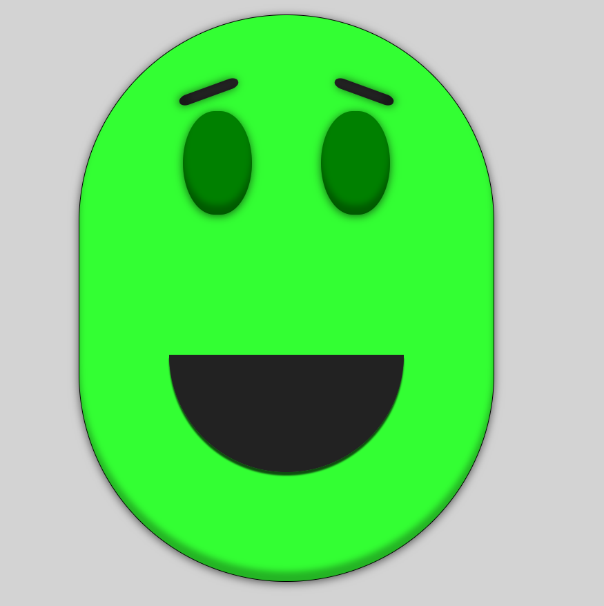
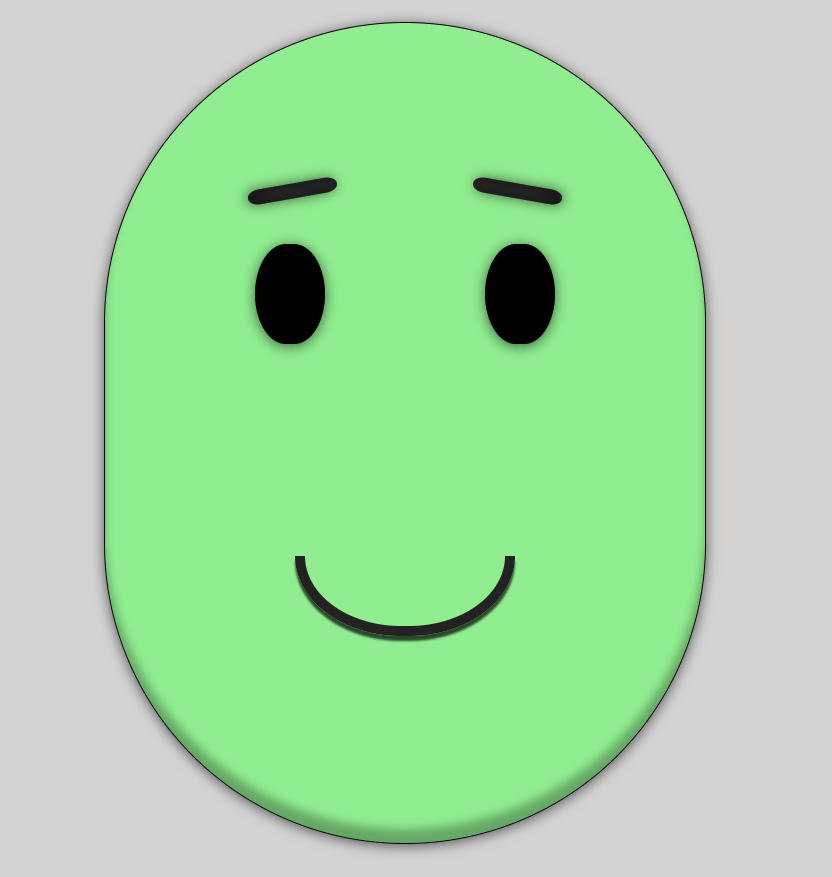
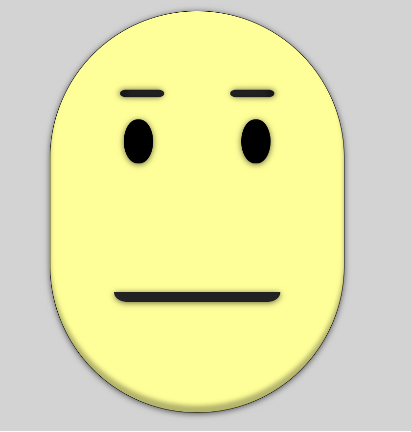
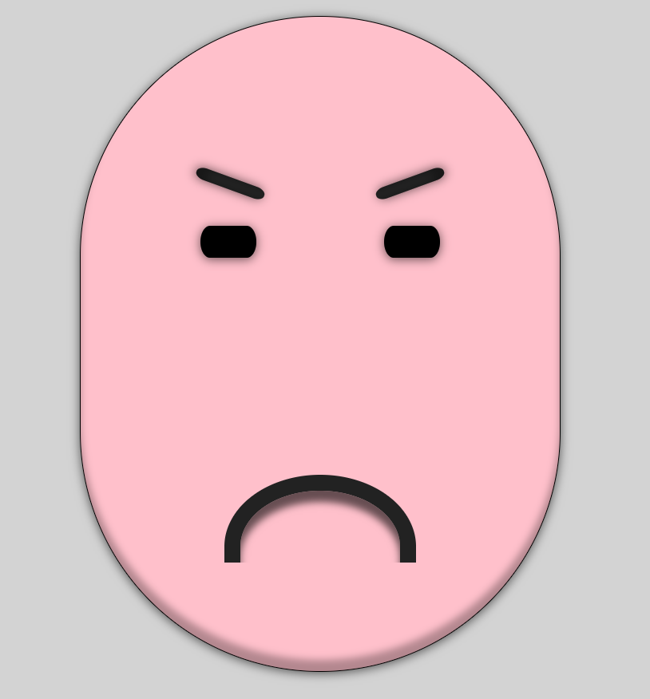
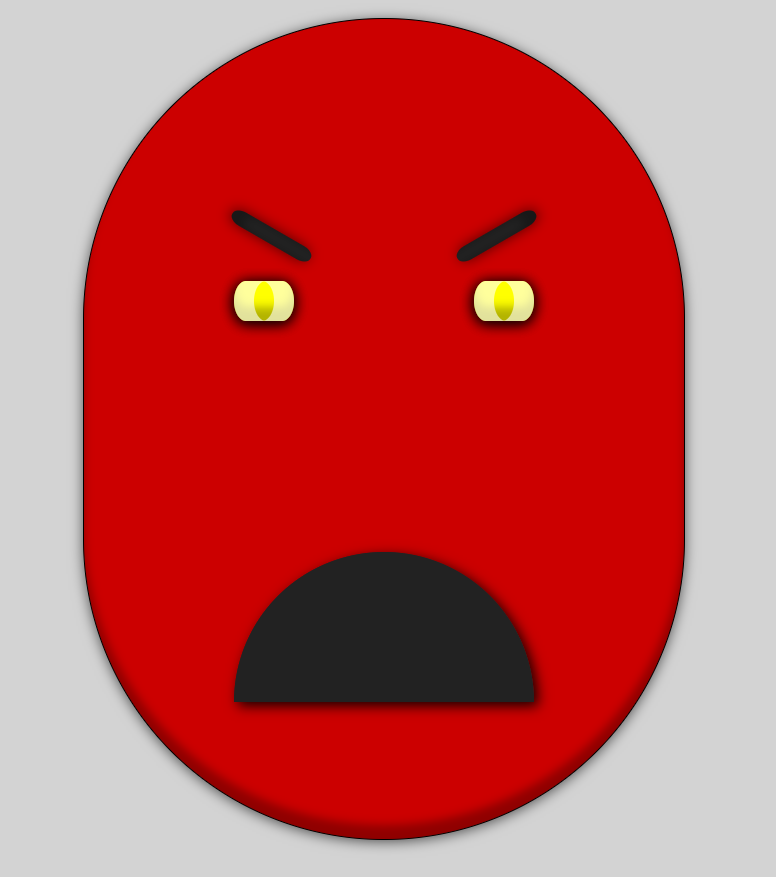

faces
=====

## What is this for?
Main component for the old [Heatsync Lab Display](https://iceddev.com/blog/putting-a-face-on-the-local-lab/).

## Ecstatic

## Happy

## Mellow

## Upset

## Angry

